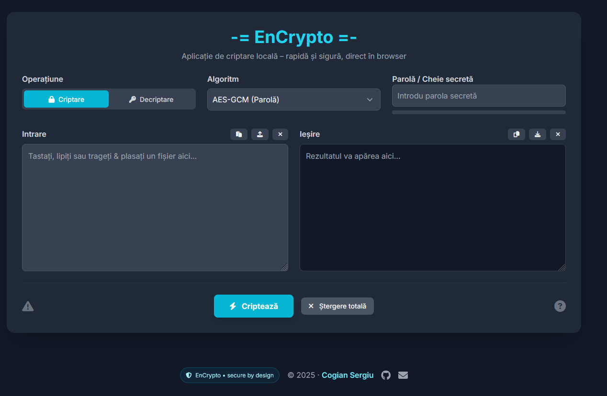

# -= EnCrypto =-
**Aplicație web pentru criptare & decriptare locală (client-side) folosind Web Crypto API.**

[](#)
[](#)
[](#)
[](#license)

> **Pe scurt:** totul se întâmplă în browserul tău. Datele nu părăsesc dispozitivul. Ai AES-GCM cu parolă și RSA-OAEP cu pereche de chei.

---

## 🖼️ Demo / Screenshot



---

## ✨ Funcționalități
- 🔐 **Criptare / Decriptare** text & fișiere
- ⚙️ **Algoritmi**:  
  - **AES-GCM (256-bit)** cu parolă (PBKDF2 / 100k iter., SHA-256)  
  - **RSA-OAEP (2048, SHA-256)** cu pereche de chei (publică/privată)
- 🧰 **Gestionare chei RSA**: generare, import/export (JWK)
- 📎 Drag & drop fișiere, copiere/lipire text, descărcare rezultat
- 🧪 Bară de **putere parolă** în timp real
- 🧊 UI modern cu **Tailwind**, tooltips, stări și feedback clar
- 💻 100% **client-side** (fără server)

---

## 📁 Structura proiectului
```
/
├─ index.html         # aplicația (totul într-un singur fișier)
├─ assets/
│   └─ screenshot.png # (opțional) captură pentru README
└─ LICENSE            # MIT (vezi mai jos)
```

---

## 🚀 Pornire rapidă

### Variante recomandate
- **1) Deschide direct** `index.html` în browser (dublu-click)  
- **2) Live Server** (VS Code) – recomandat pentru dezvoltare:
  - Install *Live Server* → click dreapta pe `index.html` → **Open with Live Server**

> **Browsere suportate:** Chrome, Edge, Firefox moderne (Web Crypto API). Safari funcționează pentru AES-GCM; RSA-OAEP poate varia pe versiunile vechi.

---

## 🧭 Utilizare

1. **Alege operațiunea:** Criptare / Decriptare  
2. **Selectează algoritmul:** AES-GCM (parolă) sau RSA-OAEP (chei)  
3. **Introdu datele:** tastează text, lipește din clipboard sau trage un fișier  
4. **Apasă `Procesare`**  
5. **Salvează rezultatul:** `Descărcare` sau `Copiază`  

### AES-GCM (cu parolă)
- Introdu o parolă puternică → `Procesare`  
- La criptare, rezultatul text este **Base64** (ușor de partajat)  
- La fișiere, vei primi `.enc` la ieșire

### RSA-OAEP (cu chei)
- **Criptare**: ai nevoie de **cheia publică** (JWK)  
- **Decriptare**: ai nevoie de **cheia privată** (JWK)  
- Poți **generea** rapid o pereche de chei din aplicație și **exporta** JSON

---

## 🔒 Securitate (lucruri importante)
- **Nu îți pierde parola / cheia privată** → **nu pot fi recuperate**  
- PBKDF2 (100.000 iter.) + AES-GCM (256-bit) pentru criptare simetrică  
- RSA-OAEP (2048) pentru scenarii asimetrice (mesaje scurte / chei simetrice)  
- **Totul este local**. Nu există backend, nu se trimit date către servere.

> **Note:** AES-GCM are tag de autentificare (integritate). Dacă parola/cheia e greșită sau datele s-au corupt, decriptarea va eșua.

---

## 🛠️ Personalizare

### Titlu & Branding
- Schimbă titlul în `<head>` și `<h1>`:
```html
<title>-= EnCrypto =-</title>
<h1 class="text-3xl md:text-4xl font-bold text-cyan-400">-= EnCrypto =-</h1>
```

### Footer
- Footer-ul este minimalist & transparent:
```html
<footer class="site-footer mt-10">
  <div class="max-w-6xl mx-auto px-6 py-8 flex flex-col md:flex-row items-center justify-between gap-4">
    <div class="flex items-center gap-3">
      <span class="badge"><i class="fas fa-shield-halved"></i> EnCrypto • secure by design</span>
    </div>
    <div class="text-center text-gray-400 order-last md:order-none">
      © 2025 · <span class="text-cyan-300 font-semibold">Cogian Sergiu</span>
    </div>
    <div class="flex items-center justify-center gap-4">
      <a href="https://github.com/neurici" class="link" aria-label="GitHub"><i class="fab fa-github fa-lg"></i></a>
      <a href="mailto:neurici@gmail.com" class="link" aria-label="Email"><i class="fas fa-envelope fa-lg"></i></a>
    </div>
  </div>
</footer>
```

### Stiluri utile (Tailwind + custom)
```css
.site-footer { position: relative; overflow: hidden; backdrop-filter: blur(0); }
.badge { display:inline-flex; align-items:center; gap:.5rem; padding:.4rem .7rem; border-radius:9999px;
  background: rgba(6,182,212,.08); border:1px solid rgba(6,182,212,.25); font-size:.75rem; color:#a5f3fc; }
.link { color:#9ca3af; transition: color .2s ease; } .link:hover { color:#22d3ee; }
```

---

## 📦 Tehnologii & Decizii
- **Web Crypto API**: `subtle.crypto` (nativ în browser)
- **AES-GCM 256-bit** + **PBKDF2 / SHA-256 / 100k iter.**
- **RSA-OAEP 2048 / SHA-256**
- **Tailwind CSS** (CDN) + **Font Awesome** (iconițe)
- Zero dependențe de build – **un singur fișier HTML**

---

## 🧩 Roadmap (idei)
- [ ] Export/import configurări (salt/iv/parametri) ca profil  
- [ ] „Hybrid crypto”: RSA pentru cheie + AES pentru payload mare  
- [ ] Suport drag & drop multiplu + progres  
- [ ] PWA (instalabil pe desktop/telefon)  
- [ ] Localizare multi-lang (RO/EN toggle UI)

---

## 🤝 Contribuții
Orice PR e binevenit:
1. Fork & clone
2. Creează branch: `feat/nume-functie`
3. Commit cu mesaje clare
4. PR → descrie schimbările + capturi

Stil:
- păstrează UI curat, fără culori stridente
- respectă structura evenimentelor și naming-ul actual

---

## 🧪 Testare rapidă
- **Text scurt:** criptare/decriptare AES cu parolă simplă → trebuie să meargă  
- **Fișier mic:** `.txt` → criptare → descarcă `.enc` → decriptare  
- **RSA:** generează chei, criptează scurt text cu public key → decriptează cu private key

---

## ❓ Întrebări frecvente (FAQ)

**1) Pot recupera datele fără parolă / cheie?**  
Nu. Nu există backdoor.

**2) De ce primesc „Decriptarea a eșuat”?**  
Parola/cheia greșită sau datele au fost alterate (AES-GCM verifică integritatea).

**3) Pot cripta fișiere mari cu RSA?**  
Nu direct. RSA e pentru cantități mici (ex: criptarea unei chei simetrice). Pentru fișiere mari folosește AES (deja inclus).

**4) Merge offline?**  
Da. După ce ai încărcat pagina o dată, poți salva fișierul și rula local.

---

## 📜 License
**MIT License**

```
Copyright (c) 2025 Cogian Sergiu

Permission is hereby granted, free of charge, to any person obtaining a copy
of this software and associated documentation files (the “Software”), to deal
in the Software without restriction, including without limitation the rights  
to use, copy, modify, merge, publish, distribute, sublicense, and/or sell  
copies of the Software, and to permit persons to whom the Software is  
furnished to do so, subject to the following conditions:

The above copyright notice and this permission notice shall be included  
in all copies or substantial portions of the Software.

THE SOFTWARE IS PROVIDED “AS IS”, WITHOUT WARRANTY OF ANY KIND, EXPRESS  
OR IMPLIED, INCLUDING BUT NOT LIMITED TO THE WARRANTIES OF MERCHANTABILITY,  
FITNESS FOR A PARTICULAR PURPOSE AND NONINFRINGEMENT. IN NO EVENT SHALL  
THE AUTHORS OR COPYRIGHT HOLDERS BE LIABLE FOR ANY CLAIM, DAMAGES OR OTHER  
LIABILITY, WHETHER IN AN ACTION OF CONTRACT, TORT OR OTHERWISE, ARISING FROM,  
OUT OF OR IN CONNECTION WITH THE SOFTWARE OR THE USE OR OTHER DEALINGS IN THE  
SOFTWARE.
```

---

## 🧾 Credits
Creat cu grijă pentru securitate și simplitate.  
Design & dev: **Cogian Sergiu** • „EnCrypto — secure by design”.
